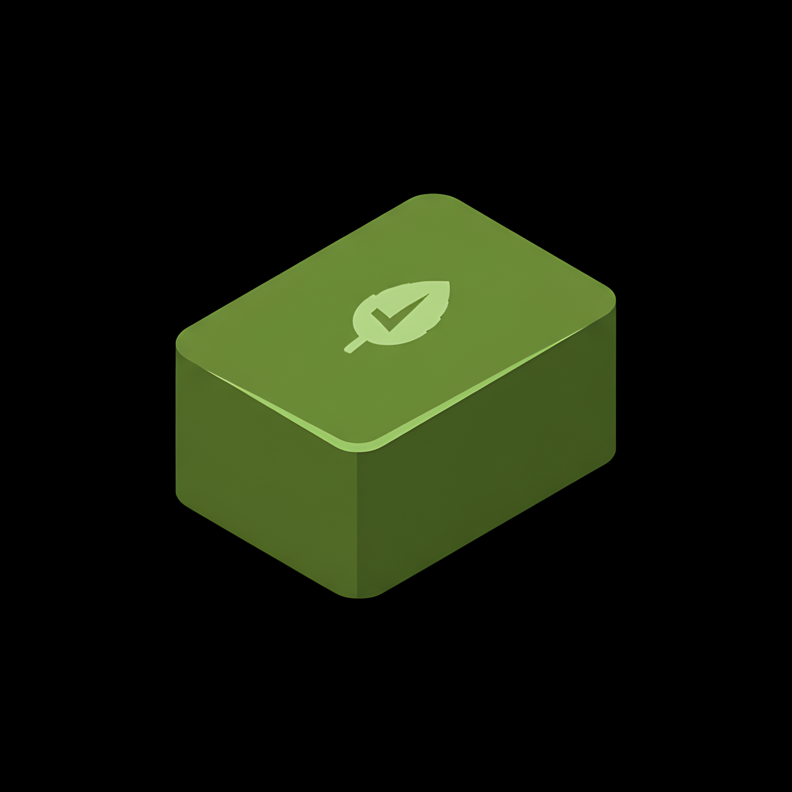
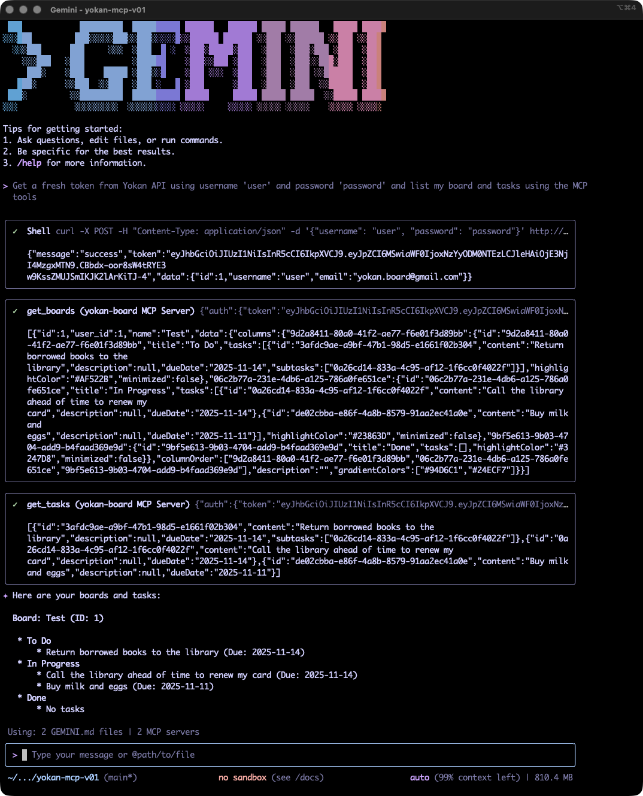

# Yokan Board MCP

<p align="center">
  
</p>

This project is a Model Context Protocol (MCP) server for the Yokan Kanban Board API. It provides a tool-based interface for AI agents to interact with and manage Kanban boards, columns, and tasks.



## Features

-   **Board Management:** Create, retrieve, update, and delete Kanban boards.
-   **Column Management:** Create, retrieve, update, reorder, and delete columns within a board.
-   **Task Management:** Create, retrieve, update, move, and delete tasks.
-   **Agent-Ready:** Designed to be used by AI agents via the Master Control Protocol.

## Tech Stack

-   [Python](https://www.python.org/)
-   [FastAPI](https://fastapi.tiangolo.com/)
-   [Pydantic](https://pydantic-docs.helpmanual.io/)
-   [fastmcp](https://github.com/path-to-fastmcp)

## Getting Started

### Building and Running Docker Image

For new users or those who want to run the server without setting up a development environment, we recommend using Docker.

1.  **Build the Docker image:**

    ```bash
    docker build -t yokanboard/yokan-mcp .
    ```

2.  **Run the Docker container:**

    ```bash
    docker run -p 8888:8888 --name yokan-mcp -e YOKAN_API_BASE_URL=http://your-yokan-api-host:port/api yokanboard/yokan-mcp
    ```

    Make sure to replace `http://your-yokan-api-host:port/api` with the actual URL of your Yokan API instance.

### MCP Clients Configuration

#### Gemini CLI with the Streamable Transport

Create `.gemini/settings.json` with the following content:

```json
{
    "mcpServers": {
        "yokan-board": {
            "httpUrl": "http://[your-yokan-mcp-host]:8888/mcp",
            "headers": {
                "Authorization": "Bearer [TOKEN]",
                "accept": "application/json"
            }
        }
    }
}
```

#### VS Code Copilot with the Stdio Transport

Create `.vscode/mcp.json` file with the following content:

```json
{
    "servers": {
        "yokan-board-mcp": {
            "type": "stdio",
            "command": "uv",
            "args": [
                "run",
                "--directory",
                "/full/path/to/github-repo-for-yokan-board/yokan-board-mcp",
                "-m",
                "src.main",
                "--stdio"
            ]
        }
    }
}
```

## Development

### Prerequisites

*   Python 3.8+
*   `uv` (for managing the Python environment)
*   Access to a running instance of the [Yokan API](https://github.com/racknerd/yokan-board-v01).

### Setup

1.  **Clone the repository:**
    ```bash
    git clone https://github.com/yokan-board/yokan-board-mcp.git
    cd yokan-board-mcp
    ```

2.  **Create and activate a virtual environment:**
    ```bash
    uv venv
    source .venv/bin/activate
    ```

3.  **Install the dependencies:**
    ```bash
    uv sync
    ```

### Configuration

1.  Create a `.env` file by copying `.env.example`:
    ```bash
    cp .env.example .env
    ```
2.  Edit the `.env` file to point to your Yokan API instance:
    ```
    YOKAN_API_BASE_URL=http://your-yokan-api-host:port/api
    ```

### Running the Server

To start the MCP server for development, run the following command:

```bash
uvicorn src.main:app --host localhost --port 8888 --reload
```

## Testing

To run the integration tests, you need to have a running Yokan API instance and a test user. The tests are configured to use the username `user` and password `password`.

Make sure your `.env` file is correctly configured with the `YOKAN_API_BASE_URL`.

Run the tests using the following command:

```bash
make test
```

## Available Tools

The MCP server exposes the following tools for managing a Yokan Kanban board:

| Category | Tools                                                                                                             |
| :------- | :---------------------------------------------------------------------------------------------------------------- |
| Boards   | `get_boards`, `get_board`, `create_board`, `update_board`, `delete_board`                                         |
| Columns  | `create_column`, `get_columns`, `update_column`, `reorder_columns`, `delete_column`, `update_column_color`        |
| Tasks    | `create_task`, `create_tasks`, `get_tasks`, `update_task`, `move_task`, `delete_task`                             |

## Usage Examples

You can interact with the MCP server using the `fastmcp` client library.

### Authentication

To use the tools, you first need to obtain a JWT token from your Yokan API instance. You can do this by sending a `POST` request to the `/login` endpoint of the Yokan API.

**Example using `curl`:**

```bash
curl -X POST \
  -H "Content-Type: application/json" \
  -d '{"username": "your_username", "password": "your_password"}' \
  http://localhost:3001/api/v1.1/login
```

### Example: Interacting with the MCP Server

A Python example demonstrating how to use the `fastmcp` client to interact with the Yokan MCP server can be found in [`examples/mcp_client.py`](./examples/mcp_client.py).


## Copyright

Yokan Board MCP is created by: **Julian I. Kamil**

© Copyright 2025 Julian I. Kamil. All rights reserved.

## License

Yokan Board MCP is available under a dual license:

- **AGPLv3**: Free to use, modify, and distribute under the terms of the GNU Affero General Public License Version 3 (see [LICENSE.AGPLv3](LICENSE.AGPLv3))
- **Commercial License**: Available for organizations that wish to use Yokan without AGPLv3's copyleft requirements (see [LICENSE.COMMERCIAL](LICENSE.COMMERCIAL))

For information on commercial use licensing, please email: yokan.board@gmail.com
